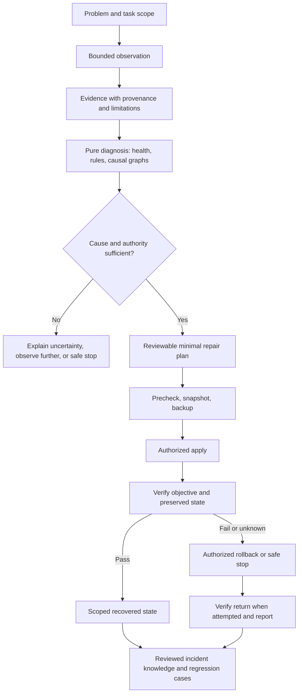

# CARE architecture

Status: **CONCEPT**. Genesis defines responsibilities and prose contracts only.
No engines, adapters, scanners, repair services, or GUI are implemented.

CARE is a recovery architecture learned from incidents. It connects observations
to evidence-backed diagnosis and narrowly justified recovery while preserving
healthy state and explicit uncertainty.

Failed recovery can teach useful lessons, but it does not produce a verified
repair rule. The diagram's knowledge boundary retains failures and uncertainty;
promotion to reusable repair knowledge has additional evidence gates.

## Separation of responsibilities

Observation describes what a bounded probe could establish. Evidence retains
origin and context. Diagnosis interprets it without mutation. Planning proposes
a concrete change; permissions determine whether it may execute. Verification
tests explicit outcomes, and rollback or safe stop has its own preconditions.
Reporting preserves all of those distinctions for humans and machines.

The eventual engine boundaries below are conceptual responsibilities, not a list
of modules to scaffold. A first implementation may be small; extracted engines
should follow actual coherence and testing needs.

| Candidate engine | Inputs and outputs | Boundary |
| --- | --- | --- |
| ObservationEngine | Scoped probe request → observations and probe outcomes | No implicit repair; disclose probe effects |
| EvidenceEngine | Observations/references → provenance-aware evidence | Preserve conflicting, stale, and unavailable sources |
| HealthEngine | Task criteria and evidence → component health with scope | Known healthy state is explicit; gaps remain unknown |
| RuleEngine | Facts and versioned rules → findings and limitations | Pure evaluation; never direct mutation |
| DependencyEngine | Task/component requirements → dependency relationships | Presence does not establish task necessity |
| CapabilityEngine | Requirements and evidence → capability availability | One failed prerequisite does not condemn the whole machine |
| SnapshotEngine | Scoped observations → sanitized identified snapshot | A snapshot is not automatically a backup |
| DeltaEngine | Compatible snapshots → differences and knowledge changes | Difference does not prove causality |
| MigrationEngine | Before/after context and transition evidence → transition analysis | No invented version incompatibility |
| RepairPlanningEngine | Diagnosed cause, constraints, authority requirements → proposed plan | Plan is not a grant or an execution result |
| BackupEngine | Approved target scope → backup references and recoverability evidence | Protect important state; failed prerequisites stop mutation |
| RepairEngine | Authorized plan and valid preconditions → bounded changes and execution record | No scope expansion or arbitrary script authority |
| VerificationEngine | Criteria and relevant observations/tests → scoped verification result | A command exit or replayed snapshot is not fresh end-to-end proof |
| RollbackEngine | Recovery plan, current state, backups → return or safe stop | Repair-specific; preserve unrelated concurrent changes |
| ReportEngine | Shared records → human and machine views | No hidden second diagnostic or risk policy |
| CaseStudyEngine | Reviewed incident records → sanitized cases and knowledge candidates | Unverified anecdote cannot become an automatic repair |

## Proposed contracts

The [evidence](EVIDENCE_MODEL.md), [unknown](UNKNOWN_MODEL.md), and
[health](HEALTH_MODEL.md) models feed the [root-cause graph](ROOT_CAUSE_MODEL.md),
[dependency graph](DEPENDENCY_GRAPH.md), [capability graph](CAPABILITY_GRAPH.md),
and [rule contract](RULE_CONTRACT.md). [State](STATE_MODEL.md),
[snapshot](SNAPSHOT_MODEL.md), [delta](DELTA_MODEL.md), and
[migration](MIGRATION_MODEL.md) contracts establish comparable context.

The [repair](REPAIR_CONTRACT.md), [verification](VERIFICATION_CONTRACT.md), and
[rollback](ROLLBACK_MODEL.md) models govern mutation under the
[security boundary](SECURITY_MODEL.md). [Human explanations](HUMAN_EXPLANATION.md)
and the [machine interface](MACHINE_INTERFACE.md) consume the same records.

Records should eventually correlate incident, task, component, observation,
evidence, rule revision, hypothesis/cause, plan, authorization, backup, execution,
verification, and return. This is a semantic requirement, not a commitment to
event sourcing, a graph database, or one persistence technology.

## Adapter direction

Adapters translate concrete environment facts and operations into these contracts
without discarding scope, identity, provenance, privilege context, or uncertainty.
Candidate families include Windows, Linux, WSL, macOS, .NET, Java, Node, Python,
Go, Rust, CUDA, containers, Git, databases, and AI providers. They are not
implemented or supported by Genesis.

An adapter needs bounded probe descriptions, capability/applicability limits,
effects and permissions, source mapping, sanitation, failure interpretation, and
tests. Read-only intent is not proof that a command has no side effects. Retain
platform-specific meaning; derive common abstractions from real second-domain
evidence rather than assuming universal OS or runtime semantics.

## Human recovery playground direction

A future human surface may show system health, dependencies, incidents, evidence,
state timelines, proposed repairs, before/after views, rollback availability,
simulation, and verification. It should explain which components to preserve,
repair, or investigate. It may start as clear text. No GUI framework is selected,
and a control cannot bypass the same executor policy used by machine consumers.

## Independent systems and growth

[CWRE](CWRE_RELATIONSHIP.md) remains the concrete Windows/Codex implementation.
[HAAEP](HAAEP_RELATIONSHIP.md) may consume recovery intelligence;
[ARX](ARX_RELATIONSHIP.md) may supply/reconcile evidence;
[Dragon-Hydra](DRAGON_HYDRA_RELATIONSHIP.md) may orchestrate work subject to
recovery constraints. No source migration or integration occurs in Genesis.

Implement one evidenced capability only after a case teaches what is needed.
Contract serialization, version negotiation, process isolation, storage,
deployment, and implementation language remain open. The
[roadmap](ROADMAP_2_YEARS.md) gives direction; [progress](PROGRESS.md) owns the one
current next action.
