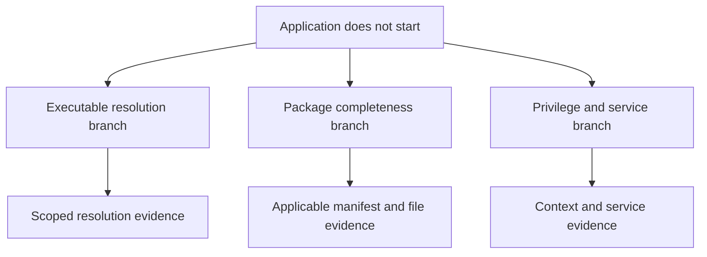

# Root-cause model

**Status: CONCEPT.** Genesis defines reasoning boundaries; it does not implement a causal graph engine.

**ADOPTED PRINCIPLE:** A symptom is not its cause, and one incident may have several independent or interacting causes.

## Separate claim types

| Claim type | Meaning |
| --- | --- |
| Symptom | The reported or observed undesirable behavior. |
| Observed fact | A bounded claim supported by identified observations. |
| Inference | An interpretation derived from facts and stated assumptions. |
| Hypothesis / possible cause | A proposed explanation requiring discriminating evidence. |
| Confirmed cause | A causal contribution established to the incident's defined evidentiary standard and scope. |
| Unknown / unsupported assessment | A conclusion that cannot currently be made, with the reason exposed. |

A confirmed cause is not necessarily the sole cause, the earliest historical cause, or an explanation for every symptom. Keep those claims separate.

## Graph direction

A future graph may connect symptom nodes to component and capability failures, causal candidates, environmental conditions, evidence, and proposed discriminating checks. Each edge needs a type and an evidentiary status. “Depends on,” “observed with,” “supports,” “contradicts,” and “causally contributes to” must not be interchangeable.

The [dependency graph](DEPENDENCY_GRAPH.md) describes requirements. The [capability graph](CAPABILITY_GRAPH.md) describes conditions for performing a task. A root-cause graph uses both while preserving causal uncertainty.

This diagram shows investigation branches, not established causes. Multiple branches can remain relevant after one branch is repaired.

## Confirming a contribution

Before calling a candidate confirmed, define the symptom and affected scope, establish that the candidate applies to the failing execution path, connect evidence to the proposed mechanism, and evaluate plausible competing explanations. Use safe reproduction, controlled synthetic evidence, authoritative semantics, or a justified intervention as appropriate, clearly retaining their different provenance.

A hypothesis is not a license for a live experiment. Any intervention still requires a scoped plan, risk classification, appropriate authorization, preservation checks, and a safe-stop boundary. A synthetic reproduction can validate a reasoning example without confirming the same cause on a real machine.

Version correlation or a successful workaround alone does not prove causality. If evidence cannot distinguish two plausible explanations, retain both as candidates and report the unresolved discriminator.

## Repair ordering

Order candidate repairs using confirmed prerequisites, affected scope, risk, reversibility, and diagnostic value. Do not impose one universal order such as “reinstall first.” An executable-selection issue may need resolving before a package-health check can evaluate the intended installation; a missing helper can remain a separate blocker afterward.

Prefer a bounded change followed by fresh verification when feasible. If several changes must form one repair transaction, document why they cannot be separated and the limits this places on causal attribution.

## Generalization boundary

Record incident-local conclusions before proposing a reusable rule. Promote a general rule only after reviewing its applicability, competing explanations, required facts, and regression cases. Retain evidence of unsuccessful hypotheses and rollback outcomes without presenting them as verified repair knowledge.

See [case studies](CASE_STUDIES.md), [rule contracts](RULE_CONTRACT.md), and [verification](VERIFICATION_CONTRACT.md).
